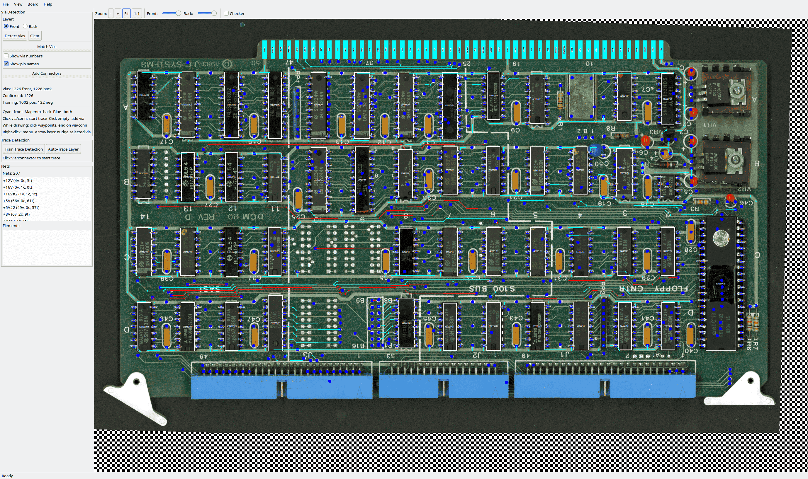

# PCB Tracer

A PCB reverse engineering tool written in Go with a GTK3 GUI. Designed for tracing vintage computer boards — S-100, ISA, Multibus, ECB/Eurocard, and STD Bus systems.



The current status is that it is becoming a useful tool to analyze a board, but there is still a tremendous amount of automation that is possible.

## Todos: 

### current manual steps that can be automated:

- via detection for two-side visible vias
- chip pin assignment
- trace detection between connectors, vias and pins
- alignment is way too fragile
- auto-detect component packages from board scan (bounding boxes exist, but placement is manual)
- auto-populate part library from detected component labels (OCR → library lookup)
- batch net naming from connector signal definitions (propagate pin names through connected nets)

### bugs:
- OCR is pretty bad
- logo detection is awful
- the UI is pretty slow, maybe there are some polynomial time searches that need to be hashed
- zoom out with cursor centering clips at scroll boundary (can't scroll to negative offsets)
- net reconciliation runs on every overlay rebuild — expensive for large boards
- deleting a trace that splits a net doesn't always clean up orphan single-element nets

### missing features:
- undo/redo for trace, via, and net operations
- netlist export (KiCad, PADS, generic CSV)
- schematic generation from traced netlist
- DRC (design rule check) — detect unconnected pins, shorted nets
- multi-select for bulk via/trace operations
- search/filter in net list and component list
- print or PDF export of board with overlay annotations
- support for multi-layer boards (4+ layers)
- passive component detection (resistors, capacitors, discrete semiconductors)
	
## Features

### Image & Alignment
- Image loading (TIFF, PNG, JPEG) with automatic DPI extraction
- Layer management with visibility and opacity controls
- Mouse wheel zoom centered on cursor, middle-click pan
- Automatic gold edge contact detection using HSV color filtering
- Contact sampling via rubber-band selection to train color detection
- Front/back image alignment using detected contacts
- Ejector mark detection for precision alignment
- Manual alignment adjustment (offset, rotation, shear)

### Board Support
- **S-100 (IEEE 696)**: 100-pin, 50 per side, 0.125" pitch
- **ISA 8-bit**: 62-pin edge connector
- **ISA 16-bit**: 98-pin edge connector
- **Multibus I**: 86-pin (P1) or 146-pin (P1+P2)
- **ECB/Eurocard**: 64-pin DIN 41612
- **STD Bus**: 56-pin

### Via Detection & Management
- Hough circle transform and contour analysis detection
- Manual via placement and confirmation
- Cross-side matching (front/back correlation)
- Training set with parameter annealing
- Arrow-key nudging, radius adjustment
- Auto-assign component ID and pin number from nearest DIP

### Trace Drawing & Editing
- Interactive polyline trace drawing between vias, connectors, and junctions
- Auto-trace along copper skeleton between adjacent vias
- Vertex editing: move (right-click drag) and delete vertices
- Start traces from vias, connectors, or existing junction vertices
- Per-layer traces (front/back) with side-aware filtering
- Junction dots at trace intersection points (not at vias/connectors)

### Electrical Netlist
- Automatic net creation and merging when traces connect elements
- Union-find based net reconciliation (single source of truth)
- Side-aware connector matching (front traces join front connectors only)
- Net name priority: manual names > signal names > component.pin > auto-generated
- Net splitting when traces are deleted
- Net list panel with per-net element display
- Right-click context menu: rename net, delete net, remove/delete elements
- Signal name resolution from parts library (output pins rename nets)

### Component Detection & Library
- Black plastic IC detection with HSV color profiling
- DIP package support (DIP-8 through DIP-40)
- DIP-aware pin guessing based on component geometry
- OCR for component labels (Tesseract v5)
- Component library with part definitions, pin names, and signal directions
- Fuzzy part matching: aliases, normalized part numbers (strips family codes, suffixes)
- Package mismatch fallback with warning
- Manufacturer logo template matching

### Connectors
- Persistent board edge connectors with per-pin signal names
- S-100 pin map with complete IEEE 696 signal definitions
- Per-side overlay rendering with Cairo labels
- Connector hit-zone based net association

### Project Management
- JSON-based `.pcbproj` project files
- Saves/restores all alignment, component, via, trace, and net state
- Viewport state persistence (zoom, scroll, active panel)
- Hot reload for development

## Architecture

```
traces/
├── main.go
├── cmd/
│   ├── ocrtrain/              # OCR parameter training tool
│   └── viatest/               # Via detection testing tool
├── internal/
│   ├── alignment/             # Contact detection, image alignment
│   ├── app/                   # Application state, event system, hot reload
│   ├── board/                 # Board specifications (S-100, ISA, Multibus, ECB, STD)
│   ├── component/             # Component detection, library, DIP definitions
│   ├── connector/             # Board edge connectors, bus pin maps
│   ├── datecode/              # IC date code decoding
│   ├── features/              # Unified feature layer, net reconciliation
│   ├── image/                 # Image loading, layers, DPI extraction
│   ├── logo/                  # Manufacturer logo detection
│   ├── netlist/               # Electrical nets, connectivity analysis
│   ├── ocr/                   # Tesseract integration, training database
│   ├── project/               # Project file management
│   ├── trace/                 # Trace detection, vectorization, skeletonization
│   ├── version/               # Build version info
│   └── via/                   # Via detection, training, cross-side matching
├── ui/
│   ├── canvas/                # Image canvas: zoom, pan, overlays, grid
│   ├── dialogs/               # Board spec editor, component dialogs
│   ├── mainwindow/            # Main window, menus, panel switching
│   ├── panels/                # Import, Components, Traces, Library, Logos, Properties
│   ├── prefs/                 # User preferences
│   └── widgets/               # Custom GTK3 widgets
└── pkg/
    ├── colorutil/             # HSV/RGB conversions
    └── geometry/              # Point, Rect, Polygon types
```

## Dependencies

- **GTK3** via [gotk3](https://github.com/gotk3/gotk3) — GUI framework
- **GoCV** (OpenCV 4.x) — image processing, detection algorithms
- **Tesseract v5** via gosseract — OCR engine

## Building

```bash
make
```

Requires OpenCV 4.x and Tesseract 5 installed.

On Linux:
```bash
make install-deps-linux
```

On macOS:
```bash
make install-deps-macos
```

## Usage

```bash
./build/pcb-tracer [project-file]
```

### Workflow

1. **Import images**: File > Import Front/Back Image (TIFF at 600+ DPI recommended)
2. **Select board type**: Configure board spec for your bus standard
3. **Detect contacts**: Sample a gold contact, then detect all edge contacts
4. **Align**: Front/back registration using detected contacts
5. **Detect vias**: Auto-detect or manually place through-hole vias
6. **Identify components**: Detect ICs, OCR labels, assign parts from library
7. **Draw traces**: Connect vias and connectors with polyline traces
8. **Build netlist**: Nets auto-merge as traces connect elements; rename for signal names

## License

GPL-3.0
