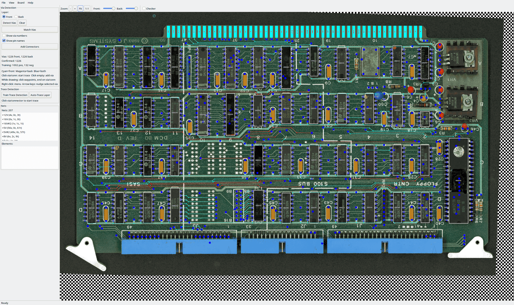

# PCB Tracer

A PCB reverse engineering tool written in Go with a GTK3 GUI. Designed for tracing vintage computer boards — S-100, ISA, Multibus, ECB/Eurocard, and STD Bus systems.



## Todos

### current manual steps that can be automated:
- batch net naming from connector signal definitions (propagate pin names through connected nets)

### bugs:
- OCR is pretty bad
- logo detection is awful
- the UI is pretty slow, maybe there are some polynomial time searches that need to be hashed
- zoom out with cursor centering clips at scroll boundary (can't scroll to negative offsets)
- net reconciliation runs on every overlay rebuild — expensive for large boards

### missing features:
- undo/redo for trace, via, and net operations
- DRC (design rule check) — detect unconnected pins, shorted nets
- search/filter in net list and component list
- print or PDF export of board with overlay annotations
- support for multi-layer boards (4+ layers)
- passive component detection (resistors, capacitors, discrete semiconductors)

## Features

### Image & Alignment
- Image loading (TIFF, PNG, JPEG) with automatic DPI extraction
- Layer management with visibility and opacity controls
- Mouse wheel zoom centered on cursor (clamped at 150%), middle-click pan
- Zoom percentage display in toolbar
- Automatic gold edge contact detection using HSV color filtering
- Contact sampling via rubber-band selection to train color detection
- Multi-pass alignment: coarse contacts + iterative via refinement
- Via-based alignment pipeline with contact fallback
- RANSAC affine alignment from via positions
- Line-following grid rescue for robust contact detection
- Ejector mark detection for precision alignment
- Manual alignment adjustment (offset, rotation, shear)
- Project-specific normalized image caching

### Board Support
- **S-100 (IEEE 696)**: 100-pin, 50 per side, 0.125" pitch
- **ISA 8-bit**: 62-pin edge connector
- **ISA 16-bit**: 98-pin edge connector
- **Multibus I**: 86-pin (P1) or 146-pin (P1+P2)
- **ECB/Eurocard**: 64-pin DIN 41612
- **STD Bus**: 56-pin

### Via Detection & Management
- Distance-transform pipeline with color confirmation and circularity checks
- Contour analysis rescue pass for missed vias
- Manual via placement with smart centering (Fourier vector-shift)
- Cross-side matching (front/back correlation)
- Training set with parameter annealing and adaptive dense filter retry
- Arrow-key nudging, radius adjustment
- Multi-select vias with shift-click
- Delete-on-hover, via/pin overlap protection
- Auto-assign component ID and pin number from nearest DIP
- Duplicate via prevention on repeated detection runs

### Component Detection & Library
- Black plastic IC detection with HSV color profiling (multiple color profiles)
- Grid-based detection pipeline with size templates and aspect ratio filtering
- DIP package support (DIP-8 through DIP-40)
- DIP pin detection with hybrid edge finding and rotation-aware positioning
- Square-pad pin 1 detection, notch/dot/chamfer recognition
- OCR for component labels (Tesseract v5) with trainable parameters
- Global component training set with auto-training on save
- OCR text correction for building training data
- Component library with part definitions, pin names, and signal directions
- Fuzzy part matching: aliases, normalized part numbers (strips family codes, suffixes)
- Auto-add detected parts to library on save
- Package mismatch fallback with warning
- Component image preview with Cairo DrawingArea
- Manufacturer logo template matching
- IC date code decoding
- Arrow-key movement, click-to-add components

### Trace Drawing & Editing
- Interactive polyline trace drawing between vias, connectors, and junctions
- Flood-fill auto-trace from individual vias with progressive threshold relaxation
- Layer-wide auto-trace with conservative fixed parameters
- Noise reduction via small-turn suppression
- Vertex editing: move (right-click drag) and delete vertices
- Delete trace from right-click context menu
- Start traces from vias, connectors, or existing junction vertices
- Per-layer traces (front/back) with side-aware filtering
- Junction dots at trace intersection points (not at vias/connectors)
- Trace cancel on right/middle click

### Electrical Netlist
- Automatic net creation and merging when traces connect elements
- Union-find based net reconciliation (single source of truth)
- Per-element type tracking (connectors, vias, traces, component pads)
- Side-aware connector matching (front traces join front connectors only)
- Net name priority: manual names > signal names > component.pin > auto-generated
- Net splitting when traces are deleted, with orphan cleanup
- Net list panel with per-net element display
- Right-click context menu: rename net, delete net, remove/delete elements
- Signal name resolution from parts library (output pins rename nets)
- Connectivity analysis (connected components)

### Netlist Export
- KiCad netlist format export
- SPICE netlist format export
- Text-based connectivity dump with net statistics
- File > Export Netlist menu

### Schematic Viewer
- Interactive schematic generated from traced netlist (File > Generate Schematic)
- Opens in a separate GTK window for side-by-side viewing with PCB
- Standard IEEE/ANSI logic gate symbols: AND, NAND, OR, NOR, XOR, NOT, BUFFER, TRISTATE, FLIPFLOP, BLOCK
- Cairo vector rendering with zoom (scroll wheel), pan (middle-click drag), and fit-to-window
- Each logic function becomes a separate symbol (e.g., 74LS00 → 4 NAND gates)
- Automatic left-to-right layout using topological sort with barycenter wire crossing minimization
- Manhattan wire routing with minimum spanning tree for multi-pin nets
- Drag symbols to rearrange; wires automatically follow
- Right-click context menu: flip horizontal, flip vertical, rotate 90°
- Net highlighting: right-click a wire to highlight all connected symbols and wires
- Re-layout button to reset automatic placement
- Show/hide stub connectors (single-terminus nets) via checkbox
- Layout persistence: symbol positions, flip, and rotation saved alongside project file
- Power port symbols (VCC/GND) separated from logic routing

### Logic Functions & Signal Propagation
- Logic function definitions for all 26 parts in the component library
- Gate types: NOT, AND, NAND, OR, NOR, XOR, BUFFER, TRISTATE, FLIPFLOP, LATCH, DECODER, MUX, COUNTER, SHIFTREG, RAM, BLOCK
- Automatic signal name propagation through logic gates (e.g., NOT gate: FOO → /FOO)
- Logic-aware netlist export showing pins grouped by gate function

### Connectors
- Persistent board edge connectors with per-pin signal names
- S-100 pin map with complete IEEE 696 signal definitions
- Per-side overlay rendering with Cairo labels
- Connector hit-zone based net association

### Project Management
- JSON-based `.pcbproj` project files
- Saves/restores all alignment, component, via, trace, and net state
- Viewport state persistence (zoom, scroll, active panel)
- Window geometry persistence (size and position across sessions)
- Hot reload for development

## Architecture

```
traces/
├── main.go
├── cmd/
│   ├── aligntest/            # Alignment testing tool
│   ├── componenttrain/       # Component detection training tool
│   ├── ocrtrain/             # OCR parameter training tool
│   └── viatest/              # Via detection testing tool
├── internal/
│   ├── alignment/            # Contact detection, via-based alignment, RANSAC
│   ├── app/                  # Application state, event system, hot reload
│   ├── board/                # Board specifications (S-100, ISA, Multibus, ECB, STD)
│   ├── component/            # Component detection, pin detection, library, DIP definitions
│   ├── connector/            # Board edge connectors, bus pin maps
│   ├── cv/                   # Computer vision utilities
│   ├── datecode/             # IC date code decoding
│   ├── features/             # Unified feature layer, net reconciliation
│   ├── image/                # Image loading, layers, DPI extraction
│   ├── logo/                 # Manufacturer logo detection
│   ├── netlist/              # Electrical nets, connectivity analysis, export (KiCad, SPICE)
│   ├── ocr/                  # Tesseract integration, training database
│   ├── project/              # Project file management
│   ├── schematic/            # Schematic generation, logic function definitions
│   ├── trace/                # Trace drawing, flood-fill auto-trace, vectorization
│   ├── version/              # Build version info
│   └── via/                  # Via detection, training, cross-side matching
├── ui/
│   ├── canvas/               # Image canvas: zoom, pan, overlays, grid
│   ├── dialogs/              # Board spec editor, component dialogs
│   ├── mainwindow/           # Main window, menus, panel switching
│   ├── panels/               # Import, Components, Traces, Library, Logos, Properties
│   ├── prefs/                # User preferences, window geometry
│   ├── schematic/            # Interactive schematic viewer (canvas, rendering, layout, routing)
│   └── widgets/              # Custom GTK3 widgets
└── pkg/
    ├── colorutil/            # HSV/RGB conversions
    ├── format/               # Output formatting utilities
    ├── geometry/             # Point, Rect, Polygon types
    └── util/                 # General utilities
```

## Dependencies

- **GTK3** via [gotk3](https://github.com/gotk3/gotk3) — GUI framework
- **GoCV** (OpenCV 4.x) — image processing, detection algorithms
- **Tesseract v5** via gosseract — OCR engine

## Building

```bash
make
```

Requires OpenCV 4.x and Tesseract 5 installed.

On Linux:
```bash
make install-deps-linux
```

On macOS:
```bash
make install-deps-macos
```

## Usage

```bash
./build/pcb-tracer [project-file]
```

### Workflow

1. **Import images**: File > Import Front/Back Image (TIFF at 600+ DPI recommended)
2. **Select board type**: Configure board spec for your bus standard
3. **Detect contacts**: Sample a gold contact, then detect all edge contacts
4. **Align**: Front/back registration using detected contacts or via-based alignment
5. **Detect vias**: Auto-detect or manually place through-hole vias
6. **Identify components**: Detect ICs, OCR labels, assign parts from library
7. **Detect pins**: Auto-detect DIP pin positions from back image
8. **Draw traces**: Connect vias and connectors with polyline traces, or use auto-trace
9. **Build netlist**: Nets auto-merge as traces connect elements; rename for signal names
10. **Export**: File > Export Netlist (KiCad or SPICE format)

## License

GPL-3.0
